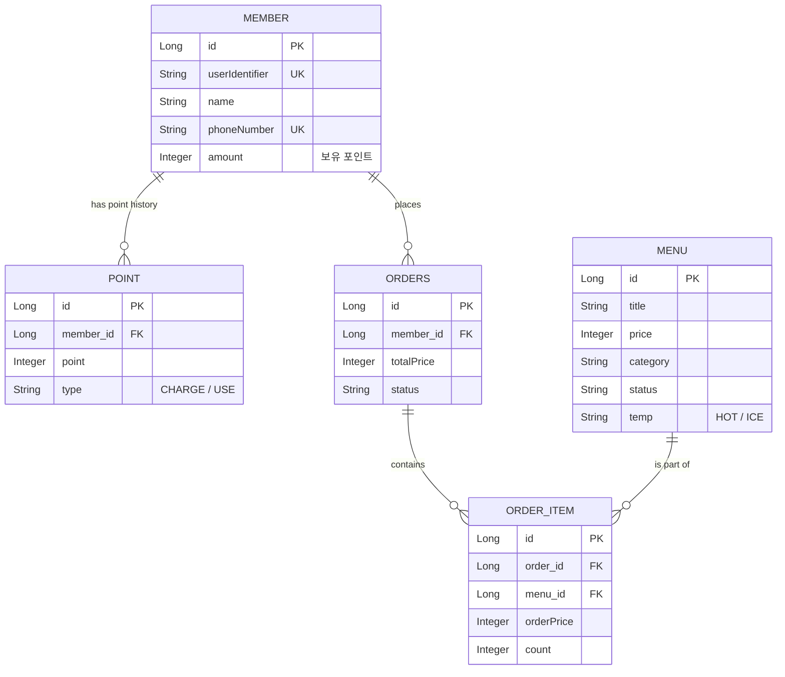

# 🧋 Coffee Order Project

> **안정적이고 확장 가능한 동시성 제어 기반의 커피 주문 및 결제 시스템**

본 프로젝트는 다수의 사용자가 동시에 주문하고 포인트를 충전하는 환경에서도 데이터 정합성을 보장하며, 실시간 랭킹 집계 및 외부 데이터 플랫폼으로의 비동기 메시지 전송 기능을 포함하는 백엔드 애플리케이션입니다.

---

## 🛠️ 개발 환경 및 사용 기술
- **Language**: Java 17
- **Framework**: Spring Boot 3.x
- **Database**: MySQL, Spring Data JPA
- **Cache & Concurrency**: Redis, Redisson
- **Message Queue**: Apache Kafka
- **Build Tool**: Gradle

---

## 💾 ERD

---

## 📑 API 명세서

| 기능명 | HTTP Method | Endpoint               |
|---|---|------------------------|
| **커피 메뉴 조회** | `GET` | `/cafe/menus`          |
| **포인트 충전** | `POST` | `/cafe/point/charge`   |
| **주문** | `POST` | `/cafe/orders`         |
| **결제** | `POST` | `/cafe/orders/payment` |
| **인기 메뉴 조회** | `GET` | `/cafe/menu/ranking`   |

---

## 🎯 문제 해결 전략 수립

### 1. 설계의 의도
본 프로젝트는 **다수의 서버 인스턴스 환경에서도 안전한 트랜잭션과 데이터의 정합성 유지**에 초점을 맞추어 설계되었습니다.
단순한 CRUD를 넘어 트래픽이 몰렸을 때 발생할 수 있는 동시성 문제와, 주문 로직과 외부 전송 로직 간의 결합도를 낮추는 아키텍처를 설계했습니다.
또한, 포인트 엔티티를 단순히 덮어쓰는 것이 아니라 `Member` 테이블에 총액을 캐싱하고 `Point` 테이블에 히스토리를 쌓아 추후 정산 및 장애 추적이 용이하도록 설계했습니다.

### 2. 선택한 문제 해결 전략 및 분석 내용
*   **동시성 문제 (포인트 충전/결제)**: 
    *   동일한 유저 식별자에 대해 동시에 여러 번의 포인트 충전/차감 요청이 발생할 경우 `Lost Update` 문제가 발생합니다.
    *   이를 해결하기 위해 애플리케이션 레벨의 락이 아닌 분산 환경에 적합한 락을 선택하여 정합성을 보장했습니다.
*   **데이터 플랫폼 전송 병목 문제**: 
    *   결제 로직 내부에 외부 API(Mock 플랫폼) 호출 코드가 있으면, 외부 시스템 장애가 우리 시스템의 결제 실패로 이어지며 응답 속도가 지연됩니다.
    *   이를 해결하기 위해 이벤트 기반 아키텍처를 차용하여 결제 완료 이벤트를 발행하고 비동기로 처리하도록 분석 및 설계했습니다.
*   **실시간 인기 메뉴 집계 성능 문제**: 
    *   DB에서 매번 최근 7일 치의 주문 테이블을 Group By로 집계하면 부하가 매우 큽니다.
    *   인메모리 데이터 스토어 구조를 활용하여 O(1) ~ O(logN) 속도로 실시간 랭킹을 추출하도록 전략을 세웠습니다.

### 3. 기술적 선택 이유 

1.  **Redisson 기반 분산 락 (Distributed Lock)**
    *   *선택 이유*: 다중 서버 환경에서는 `synchronized`나 JPA의 비관적/낙관적 락만으로는 한계가 있거나 성능 저하가 큽니다. Redisson은 Pub/Sub 기반으로 동작하여 Redis 부하를 줄이면서도 타임아웃 처리가 용이해 빠르고 안정적인 동시성 제어가 가능합니다.
2.  **Apache Kafka (메시지 큐)**
    *   *선택 이유*: 결제 로직(주 서비스)과 데이터 플랫폼 전송/랭킹 업데이트 간의 결합도를 낮추기 위해 도입했습니다. 결제가 완료되면 Kafka로 메시지만 던지고 응답을 반환하므로 성능이 크게 향상되며, 수신자 쪽이 죽어있어도 메시지가 보존되어 장애 격리(Fault Tolerance)에 매우 유리합니다.
3.  **Redis Sorted Set (ZSet) (랭킹 기능)**
    *   *선택 이유*: 일별로 키를 나누어 주문 횟수를 기록하고, 랭킹 조회 시 `ZUNIONSTORE` 명령어를 통해 7일 치 데이터를 O(N)+O(M log M)의 빠른 속도로 병합하여 실시간 인기 메뉴 TOP 3를 즉시 도출할 수 있습니다.

---

## 📈 K6 부하 테스트

### 🧪 테스트 시나리오: 포인트 충전 동시성 테스트
*   **Target API**: `POST /cafe/point/charge`
*   **가상 유저(VUs)**: 50명
*   **테스트 시간**: 20초 지속
*   **조건**: 동일한 유저(`user1`)에게 50명의 가상 유저가 동시에 지속적으로 포인트 충전을 요청

### 📊 테스트 결과 요약
*   **총 요청 수**: 4,877건 (초당 약 243건 처리)
*   **성공률**: **100%** (단 1건의 데이터 유실이나 데드락 없이 모두 순차적으로 락을 획득하여 성공)
*   **결과 분석**: 
    *   `Redisson`을 이용한 분산 락과 `AOP` 기반의 멱등성 방어 로직이 완벽하게 동작함을 확인했습니다. 
    *   초당 200건 이상의 Race Condition이 발생했음에도 데이터 정합성이 100% 유지되었습니다.
